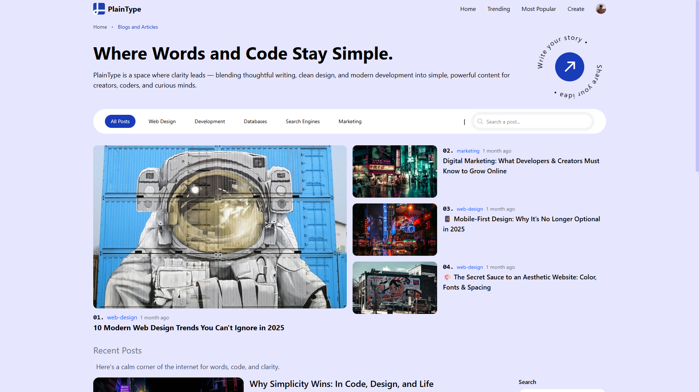
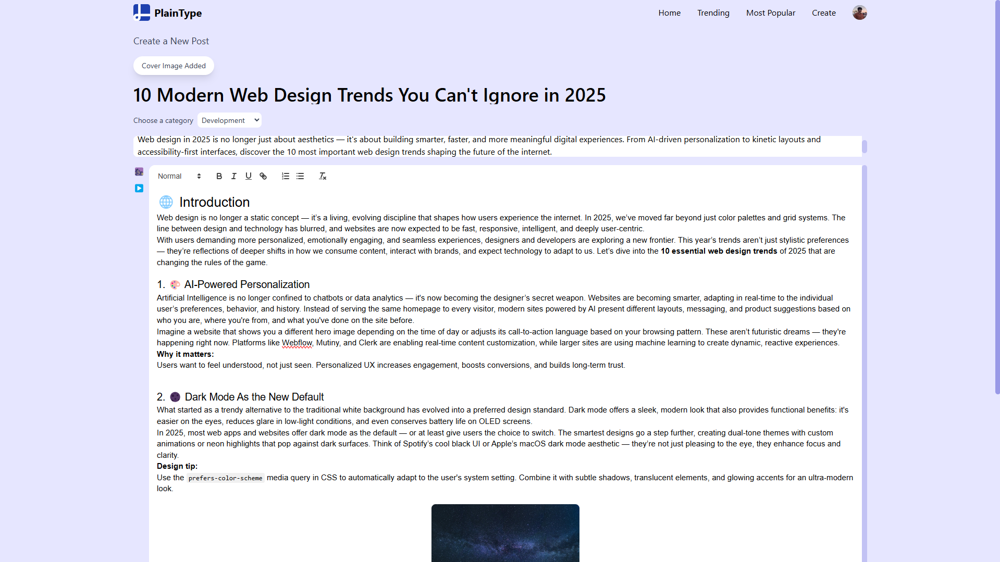
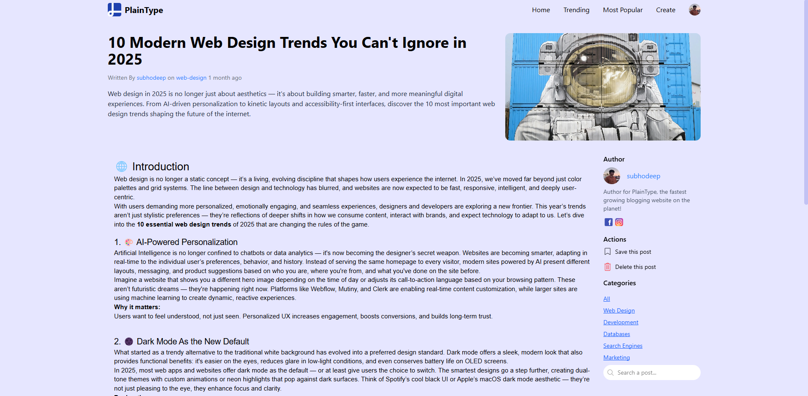
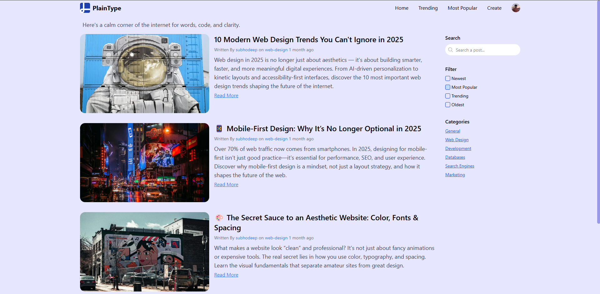
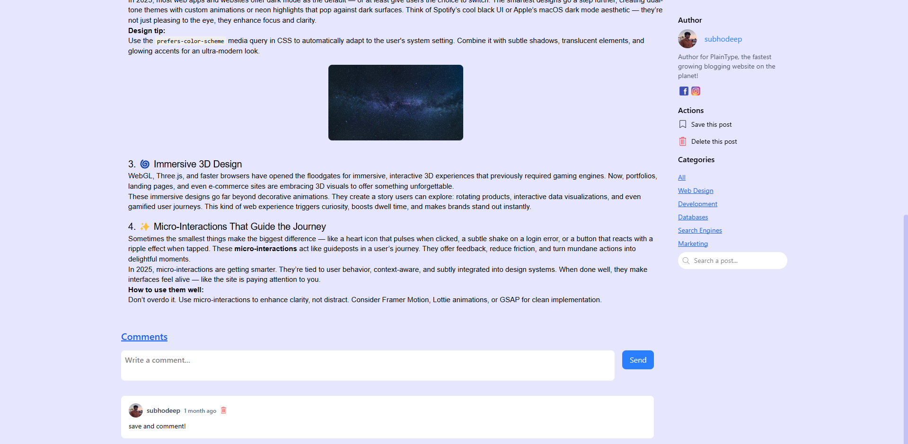

<div align="center">
  
  <h1>PlainType</h1>
  <p><strong>A Modern Full-Stack Blogging Platform</strong></p>
  
  <p>
    
    
    
    
    
  </p>

  <p>
    <a href="https://plaintype.vercel.app" target="_blank">🚀 Live Demo</a> •
    <a href="#features">✨ Features</a> •
    <a href="#screenshots">📸 Screenshots</a> •
    <a href="#installation">⚡ Installation</a> •
    <a href="#contributing">🤝 Contributing</a>
  </p>
</div>

---

## 📖 About

**PlainType** is a sleek, modern blogging platform built with cutting-edge web technologies. It provides a seamless writing and reading experience with a clean, minimalist design that puts content first.

### 🎯 Key Highlights

- **Full-Stack Solution**: Complete frontend and backend implementation
- **Modern Tech Stack**: Built with React 19, Express.js, and MongoDB
- **Responsive Design**: Beautiful UI that works on all devices
- **Rich Text Editor**: Powerful content creation with React Quill
- **User Authentication**: Secure login system powered by Clerk
- **Image Management**: Seamless image uploads with ImageKit
- **Real-time Features**: Live content updates and infinite scroll

---

## ✨ Features

### 🖊️ Content Creation
- **Rich Text Editor** with formatting options
- **Image Upload** and management
- **Draft and Publish** workflow
- **Real-time Preview**

### 👥 User Experience
- **User Authentication** with Clerk
- **Infinite Scroll** for seamless browsing
- **Responsive Design** for all devices
- **Fast Loading** with optimized performance

### 🔧 Technical Features
- **RESTful API** architecture
- **MongoDB** database integration
- **Real-time Updates** with React Query
- **Modern Routing** with React Router DOM
- **Tailwind CSS** for styling

---

## 📸 Screenshots

<div align="center">

### 🏠 Homepage


### ✍️ Create Post


### 📖 Post View


### 📱 Search View


### 📱 Comments View


</div>

---

## 🛠️ Tech Stack

<div align="center">

<table>
<tr>
<td width="50%">

### Frontend
| Technology | Purpose |
|------------|---------|
| **React 19** | UI Framework |
| **Vite** | Build Tool |
| **TailwindCSS** | Styling |
| **React Query** | State Management |
| **React Router DOM** | Navigation |
| **React Quill** | Rich Text Editor |
| **Clerk** | Authentication |
| **ImageKit** | Image Management |

</td>
<td width="50%">

### Backend
| Technology | Purpose |
|------------|---------|
| **Node.js** | Runtime Environment |
| **Express.js** | Web Framework |
| **MongoDB** | Database |
| **Mongoose** | ODM |
| **Clerk Express** | Authentication |
| **ImageKit** | Image Processing |
| **CORS** | Cross-Origin Requests |
| **Dotenv** | Environment Variables |

</td>
</tr>
</table>

</div>

---

## 🚀 Installation

### Prerequisites
- **Node.js** (v16 or higher)
- **MongoDB** (local or cloud)
- **Git**

### 1. Clone the Repository
```bash
git clone https://github.com/SubhodeepSamanta/PlainType.git
cd PlainType
```

### 2. Backend Setup
```bash
cd Backend
npm install
```

Create a `.env` file in the Backend directory:
```env
MONGODB_URI=your_mongodb_connection_string
CLERK_PUBLISHABLE_KEY=your_clerk_publishable_key
CLERK_SECRET_KEY=your_clerk_secret_key
IMAGEKIT_PUBLIC_KEY=your_imagekit_public_key
IMAGEKIT_PRIVATE_KEY=your_imagekit_private_key
IMAGEKIT_URL_ENDPOINT=your_imagekit_url_endpoint
PORT=5000
```

Start the backend server:
```bash
npm run dev
```

### 3. Frontend Setup
```bash
cd ../Frontend
npm install
```

Create a `.env` file in the Frontend directory:
```env
VITE_CLERK_PUBLISHABLE_KEY=your_clerk_publishable_key
VITE_API_URL=http://localhost:5000
VITE_IMAGEKIT_PUBLIC_KEY=your_imagekit_public_key
VITE_IMAGEKIT_URL_ENDPOINT=your_imagekit_url_endpoint
```

Start the frontend development server:
```bash
npm run dev
```

### 4. Access the Application
- **Frontend**: http://localhost:5173
- **Backend API**: http://localhost:5000

---

## 📁 Project Structure

```
PlainType/
├── Frontend/                 # React frontend application
│   ├── src/
│   │   ├── components/       # Reusable UI components
│   │   ├── pages/           # Page components
│   │   ├── hooks/           # Custom React hooks
│   │   ├── utils/           # Utility functions
│   │   └── styles/          # CSS and styling
│   ├── public/              # Static assets
│   │   └── logo.png         # PlainType logo
│   └── package.json         # Frontend dependencies
│
├── Backend/                 # Express.js backend API
│   ├── models/              # MongoDB models
│   ├── routes/              # API routes
│   ├── middleware/          # Custom middleware
│   ├── controllers/         # Route controllers
│   ├── utils/               # Backend utilities
│   └── package.json         # Backend dependencies
│
├── Screenshots/             # Application screenshots
│   ├── homepage.png         # Homepage screenshot
│   ├── create-post.png      # Create post interface
│   ├── post-view.png        # Post reading interface
│   └── mobile-view.png      # Mobile responsive design
│
└── README.md               # Project documentation
```

---

## 🎨 Scripts

### Frontend
```bash
npm run dev      # Start development server
npm run build    # Build for production
npm run preview  # Preview production build
npm run lint     # Run ESLint
```

### Backend
```bash
npm run dev      # Start development server with watch mode
npm test         # Run tests (to be implemented)
```

---

## 🌐 Deployment

### Frontend (Vercel)
1. Connect your GitHub repository to Vercel
2. Set environment variables in Vercel dashboard
3. Deploy automatically on push to main branch

### Backend (Render)
1. Create a new app on your preferred platform
2. Connect your GitHub repository
3. Set environment variables
4. Deploy the Backend directory

---

## 🤝 Contributing

We welcome contributions! Here's how you can help:

1. **Fork** the repository
2. **Create** a feature branch
   ```bash
   git checkout -b feature/amazing-feature
   ```
3. **Commit** your changes
   ```bash
   git commit -m 'Add some amazing feature'
   ```
4. **Push** to the branch
   ```bash
   git push origin feature/amazing-feature
   ```
5. **Open** a Pull Request

### 📋 Contribution Guidelines
- Follow the existing code style
- Write clear commit messages
- Add tests for new features
- Update documentation as needed

---

## 📝 License

This project is licensed under the **ISC License**. See the [LICENSE](LICENSE) file for details.

---

## 🙏 Acknowledgments

- **React Team** for the amazing framework
- **Vercel** for seamless deployment
- **Clerk** for authentication services
- **ImageKit** for image management
- **MongoDB** for database solutions

---

## 📞 Contact

**Subhodeep Samanta**
- GitHub: [@SubhodeepSamanta](https://github.com/SubhodeepSamanta)
- Project Link: [https://github.com/SubhodeepSamanta/PlainType](https://github.com/SubhodeepSamanta/PlainType)
- Live Demo: [https://plain-type.vercel.app](https://plain-type.vercel.app)

---

<div align="center">
  
  <p>Made with ❤️ by <a href="https://github.com/SubhodeepSamanta">Subhodeep Samanta</a></p>
  <p>⭐ Star this repo if you find it helpful!</p>
</div>
